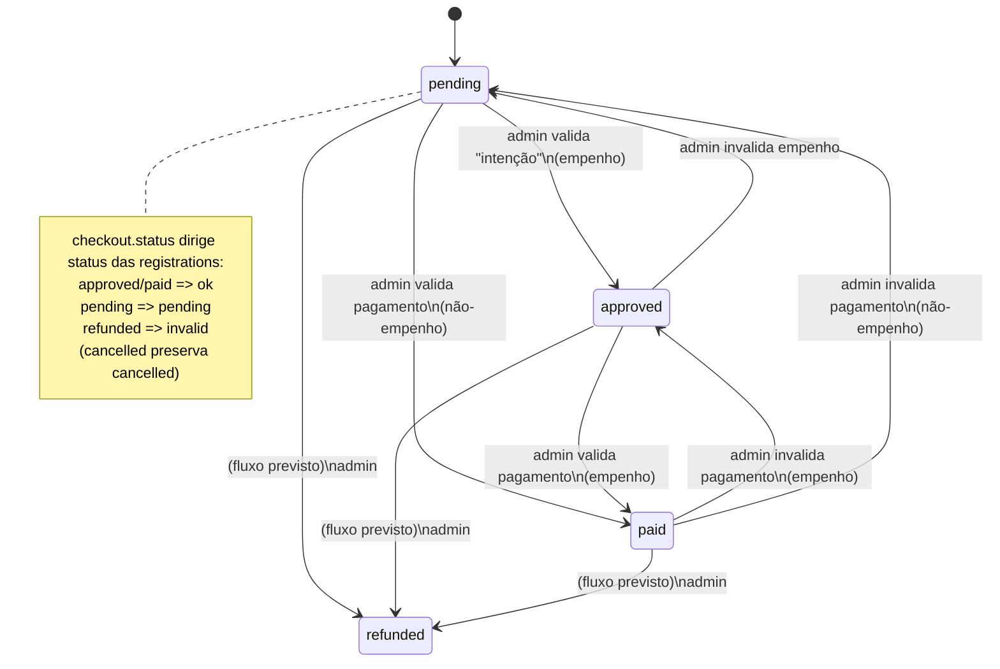
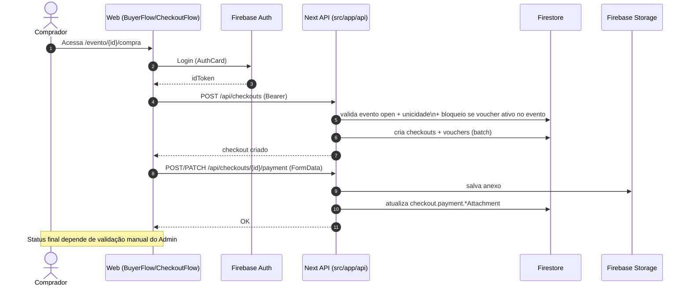
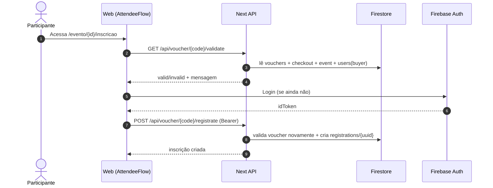

# Regras de Negócio — Migração (Practicus)

> Escopo desta análise: pastas de API em `src/app/api/*`, componentes de checkout/inscrição (buyer/attendee), e rota admin em `/inscricoes` (UI + regras de acesso).  
> Observação: “pagamento” aqui **não integra gateway**; é um fluxo de **comprovação por anexos** (Firebase Storage) + **validação manual por admin** (mudança de status no Firestore).

## Visão Geral do Domínio (Entidades e Estados)

### Entidades principais (Firestore)

- **`events`**: evento com `status` (`open` | `closed` | `canceled`) e capacidade (`maxParticipants`) + (opcional) `priceBreakpoints`.
- **`checkouts`**: compra de inscrições do comprador.
  - `checkoutType`: `"acquire"` (compra comum) | `"admin"` (cortesias/admin).
  - `status`: `"pending"` | `"approved"` | `"paid"` | `"refunded"`.
  - `payment.method`: `"card"` (na prática, pagamento manual via comprovante) | `"empenho"` (fluxo PJ com empenho).
  - `amount`: quantidade de inscrições compradas.
  - `complimentary`: cortesias extras (principalmente em checkout `admin`).
  - `voucher`: id do documento em `vouchers` associado ao checkout.
- **`registrations`** (schemaVersion 2): inscrição do participante (pode ter `checkoutId` ou ser via voucher do checkout).
  - `status`: `"ok"` | `"pending"` | `"cancelled"` | `"invalid"`.
  - Campos pessoais: `fullName`, `cpf`, `email`, `phone`, `credentialName`, etc.
- **`vouchers`**: “código” vinculado a um checkout (habilita inscrições “sem compra” para convidados/cortesias).
  - `active`: boolean.
  - `checkoutId`: string.
- **`users`**: perfil com flag **`admin: true`** (ACL).
- **`deletedCheckouts`**: arquivo/arquivamento de checkouts cancelados (admin/buyer).

### Máquina de estados (Checkout → Registration)

Fonte da regra de propagação: `getRegistrationStatusFromCheckoutStatusChange` em `src/app/api/utils.ts`.

---

## 1) Fluxos de Usuário

### 1.1 Fluxo “Comprar ingressos” (Buyer / Checkout)

**Entry point (Prismic)**: página de compra `src/app/evento/[uid]/compra/page.tsx` carrega o evento do Prismic e inicia `BuyerFlow`.

**Gate de autenticação**:
- Se **não autenticado**: `BuyerFlow` exibe `AuthCard` (login/conta).
- Se autenticado: entra no `BuyerProvider` e apresenta `CheckoutFlow`.

**Passos do checkout (UI)**:
- `select-type` → `billing-details` → `registration-form` → `payment` → `overview` (dashboard).
  - Implementado em `src/app/components/checkout-steps/CheckoutFlow.tsx`.

**Criação do checkout (API)**:
- `POST /api/checkouts` (`src/app/api/checkouts/route.ts`)
  - Cria `checkouts/{eventId}_{buyerUid}` **(ID determinístico)**.
  - Cria também `vouchers/{newId}` e grava o id no checkout.
  - Bloqueia criação se evento não estiver `open` ou se já existir checkout do mesmo usuário para o evento.
  - Bloqueia checkout se usuário já tiver inscrição ativa via voucher (sem `checkoutId`) no mesmo evento.

**Pagamento (sem gateway)**:
- Comprador anexa comprovantes no Firebase Storage via API (ver seção 5 para falhas/pontos de decisão).
- Admin valida/atualiza status (`PATCH /api/checkouts/[id]/status`), o que propaga status para as `registrations` do checkout.

**Diagrama (alto nível)**:

### 1.2 Fluxo “Inscrever-se” (Attendee / Voucher)

**Rota atual**: `src/app/evento/[uid]/inscricao/page.tsx` (Prismic) → `AttendeeFlow`.
**Rota legada**: `src/app/inscricao/[uid]/page.tsx` faz redirect para `/evento/{uid}/inscricao`.

**Gate**:
- O evento é carregado do **Firestore** via `AttendeeProvider` (não do Prismic).
- Se evento `open`: fluxo de voucher + formulário.
- Se `closed`/`canceled`: mostra aviso; permite login apenas para consultar inscrição existente.

**Passos**:
- Validar voucher (`GET /api/voucher/:id/validate`) sem auth.
- Para **submeter inscrição** é obrigatório estar autenticado.
- Criar inscrição via voucher (`POST /api/voucher/:id/registrate`) com Bearer.

**Regras-chave**:
- Voucher precisa estar `active`, checkout do voucher não pode estar `refunded`, evento não pode estar `closed`/`canceled`.
- Capacidade do voucher é calculada por `amount + complimentary` do checkout responsável.

### 1.3 Fluxo “Validação de inscrição” (público)

**Rota**: `src/app/validacao/[eventId]/page.tsx?code=<registrationId>`.

Regras:
- Procura `registrations/{code}`.
- Valida se `registration.eventId` coincide com o evento da URL.
- Busca checkout responsável e permite considerar **válida** se:
  - `registration.status === "ok"` **ou**
  - (checkout.payment.method === `"empenho"` **e** `registration.status === "pending"`).

Esse detalhe significa: **inscrições pendentes via empenho podem ser aceitas como “válidas”** para validação pública.

### 1.4 Fluxo “Administração de inscrições” (Admin / `/inscricoes`)

**Rota**: `src/app/inscricoes/page.tsx`.

Gates:
- Requer login (Firebase Auth).
- Após login chama `getUserData(user.uid)` e exige `userData.admin === true` para renderizar `AdminPanel`.

Funcionalidades principais (UI):
- Lista eventos (`AdminContext` escuta `events`).
- Seleciona evento e observa:
  - checkouts do evento (tipo `acquire` e `admin`)
  - registrations do evento
- Admin pode:
  - Atualizar status de checkout (chama API `/api/checkouts/{id}/status`)
  - Cancelar checkout (API `/api/checkouts/{id}` DELETE)
  - Atualizar status de registration (API `/api/registrations/{id}/status`)
  - Ajustar cortesias e totalValue (atualiza Firestore direto pelo client)
  - Gerar PDFs (voucher/inscrição) e exportações (xlsx)

---

## 2) Regras de Validação (campos obrigatórios e condições)

### 2.1 Checkout (criação)

API `POST /api/checkouts` valida:
- **Obrigatórios**: `eventId`, `userId`, `checkoutType`.
  - `checkoutType` ∈ {`acquire`, `admin`} (`validateCreateCheckoutRequest`).
- **Autorização**:
  - Se `body.userId` existir, precisa ser igual ao `uid` autenticado; o backend força `userId = authenticatedUser.uid`.
- **Unicidade**:
  - Só pode existir um checkout por (evento, usuário): id = `${eventId}_${uid}`.
- **Evento**:
  - Evento deve existir em `events/{eventId}` e estar `status === "open"`.
- **Conflito com inscrição via voucher (sem checkout)**:
  - Bloqueia se houver `registrations` do usuário no evento com `status` ∈ {`ok`,`pending`} **e** `checkoutId` ausente.
- **Preço**:
  - Se `events.priceBreakpoints` existir, “congela” no checkout (`priceBreakpointsAtCheckout`).
  - Calcula `totalValue` e `payment.value` via `calculateTotalPurchasePrice`.

### 2.2 Checkout (atualização)

API `PUT /api/checkouts/[id]`:
- **Bloqueia** se request tentar mandar `status` (regra: `if (data.status) return false`).
- `amount` se presente deve ser número.
- Recalcula `totalValue` apenas em uma condição específica (quando “totalValue salvo” bate com o “totalValue calculado antigo”).
- Sempre seta `status: "pending"` na atualização.
- Pode alterar `payment.method` com regras:
  - PF (`legalEntity === "pf"`) => `"card"`.
  - PJ + `paymentByCommitment === true` => `"empenho"`, senão `"card"`.

### 2.3 Registro/Inscrição (criação via checkout)

API `POST /api/registrations` valida:
- **Body obrigatório**: precisa passar `checkoutId`; e também precisa passar os campos validados por `validateCreateRegistration`:
  - **Obrigatórios**: `checkoutId`, `cpf`, `eventId`, `fullName`, `phone`, `credentialName`, `email`, `useImage`.
- **Permissão**:
  - Admin pode criar para qualquer checkout.
  - Buyer (dono do checkout) pode criar inscrições para seu checkout.
- **Capacidade** (`canActivateRegistration`):
  - Checkout não pode estar `refunded`.
  - `registration.checkoutId` deve existir.
  - Checkout precisa ter `amount` (quantidade comprada).
  - Não pode ultrapassar: número de registrations ativas do checkout (`ok`/`pending`) < `checkout.amount`.
    - Observação: aqui **não considera `complimentary`** (ver fragilidades).
- **Status inicial da inscrição**:
  - Se checkout.status ∈ {`paid`,`approved`} => `registration.status = "ok"`
  - Senão => `registration.status = "pending"`

### 2.4 Registro/Inscrição (criação via voucher)

API `POST /api/voucher/:id/registrate` valida:
- Requer auth e `body.userId === authenticatedUser.uid`.
- Valida voucher via `validateVoucher`:
  - Voucher deve estar `active`.
  - Checkout do voucher deve existir e não estar `refunded`.
  - Evento do checkout deve existir e não estar `closed` nem `canceled`.
  - Capacidade: `validRegistrations.length < (amount + complimentary)`.
    - `amount` pode ser 0 se o **buyer** do checkout for admin (`users/{buyerUid}.admin === true`).
- A inscrição gerada:
  - `attendeeUserId = authenticatedUser.uid`
  - `createdByRole = "attendee"`
  - `status`:
    - `ok` se checkout é `admin` ou checkout.status ∈ {`paid`,`approved`}
    - `pending` se checkout.status === `pending`
    - `invalid` caso contrário

### 2.5 Atualização de status (checkout)

API `PATCH /api/checkouts/[id]/status`:
- **Apenas admin**.
- `status` obrigatório e deve ser um dos: `pending`, `approved`, `paid`, `refunded`.
- Regra especial (empenho):
  - Se `payment.method === "empenho"` e checkout atual `pending`, **não permite** mudar direto para `paid`.
  - Deve passar por `approved` (“valida intenção de pagamento”) antes.
- Efeito colateral:
  - Atualiza todas `registrations` do checkout com regra de transição.
  - Se checkout antigo não tinha `voucher` e status virou `paid/approved`, cria voucher (legado/idempotência).

### 2.6 Atualização de status (registration)

API `PATCH /api/registrations/[id]/status`:
- Requer auth.
- Permissões:
  - Dono da inscrição (attendeeUserId) **ou** buyer do checkout **ou** admin.
  - Se `registration.checkoutId` não existir: somente dono/admin.
- Se status solicitado for `"ok"`, exige `canActivateRegistration(...)` para não exceder capacidade / checkout válido.

---

## 3) Integrações Externas (Firebase e Prismic) por fluxo

### 3.1 Prismic (conteúdo/SEO e páginas de evento)

Uso principal:
- Páginas `src/app/evento/[uid]/compra/page.tsx` e `src/app/evento/[uid]/inscricao/page.tsx` carregam **evento do Prismic** para banner/metadata.
- `src/prismicio.ts` define client, routes e previews.

Efeito em regras de negócio:
- O Prismic fornece conteúdo/metadata, mas o **estado de disponibilidade (open/closed/canceled)** é derivado do **Firestore** via contexts.

### 3.2 Firebase Auth (identidade e ACL)

Uso:
- Frontend obtém `idToken` e envia em `Authorization: Bearer <token>`.
- Backend valida token via `admin.auth().verifyIdToken` em `src/lib/auth-utils.ts`.

Impacto:
- Quase toda mutação de dados (create/update/delete) exige auth.

### 3.3 Firestore (fonte de verdade de negócio)

Coleções e responsabilidades:
- `events`: status/capacidade e parâmetros de venda.
- `checkouts`: compra e status de pagamento.
- `registrations`: inscrições, status, vínculo ao checkout.
- `vouchers`: habilitador de inscrições sem compra.
- `users`: `admin` flag para ACL.

Padrões:
- Backend usa batch em pontos críticos (criar checkout + voucher; atualizar checkout status + registrations).
- Frontend admin atualiza alguns campos diretamente no Firestore (cortesias, totalValue).

### 3.4 Firebase Storage (anexos de pagamento)

Armazena:
- `checkouts/{checkoutId}/commitmentAttachment`
- `checkouts/{checkoutId}/paymentReceiptAttachment`
- `checkouts/{checkoutId}/invoiceAttachment`

Metadados salvos: `originalName`, `uploadedBy`, `uploadedAt`, `contentType`.

---

## 4) Permissões (ACL) — por módulos funcionais

### 4.1 Autenticação (módulo comum)

- **Client**: depende do Firebase Auth (`AuthCard`, `useFirebase`).
- **Server**: `validateAuth(request)` lança erro se token ausente/malformado/expirado.

### 4.2 Módulo Checkout (Buyer)

- **Criar checkout** (`POST /api/checkouts`):
  - Requer auth.
  - Só permite criar checkout para o próprio usuário.
- **Atualizar checkout** (`PUT /api/checkouts/[id]`):
  - Requer auth (a permissão específica do “quem pode atualizar” não aparece nesse endpoint; precisa ser confirmada pelo código de update/validações — hoje ele não checa `owner/admin` explicitamente neste arquivo).
- **Cancelar checkout** (`DELETE /api/checkouts/[id]`):
  - Requer auth.
  - Buyer (owner) ou admin pode cancelar.
  - Buyer só pode cancelar se evento estiver `open`.

### 4.3 Módulo Pagamento (anexos + status)

- **Upload de recibo de empenho** (`POST /api/checkouts/[id]/payment`):
  - Requer auth.
  - Permite se user for dono do checkout ou admin.
  - Só se `payment.method === "empenho"` e `checkout.status === "pending"`.
- **Upload de comprovante** (`PATCH /api/checkouts/[id]/payment`):
  - Requer auth.
  - Permite se user for dono do checkout ou admin.
  - Bloqueia se `checkout.status === "paid"`.
- **Upload de nota fiscal** (`PUT /api/checkouts/[id]/payment`):
  - Requer auth e **admin**.
  - Só se `checkout.status === "paid"`.
- **Delete anexos** (`DELETE /api/checkouts/[id]/payment`):
  - Requer auth.
  - Permite se dono do checkout ou admin.
  - Regras adicionais variam por `attachmentType`.
- **Alterar status checkout** (`PATCH /api/checkouts/[id]/status`):
  - Requer auth e **admin**.

### 4.4 Módulo Inscrições (Registrations)

- **Criar inscrição via checkout** (`POST /api/registrations`):
  - Requer auth.
  - Admin ou buyer do checkout.
  - Capacidade limitada por `checkout.amount` (ver fragilidades).
- **Criar inscrição via voucher** (`POST /api/voucher/:id/registrate`):
  - Requer auth.
  - Apenas para o próprio `userId`.
  - Capacidade limitada por `amount + complimentary`.
- **Atualizar status da inscrição** (`PATCH /api/registrations/[id]/status`):
  - Requer auth.
  - Attendee owner, buyer owner do checkout ou admin.
- **Validação pública** (`/validacao/[eventId]`):
  - Sem auth.
  - Considera válido `ok` e também `pending` se for “empenho”.

### 4.5 Módulo Voucher

- **Validar voucher** (`GET /api/voucher/:id/validate`):
  - Sem auth.
  - Regras de validade exigem integridade checkout+evento e capacidade.
- **Ativar/desativar voucher**:
  - A UI admin chama `useVoucherAPI.changeVoucherActiveStatus(...)` (ver endpoints no código do hook/rotas correspondentes).

---

## 5) Pagamento — if/else, try/catch e motivos de falha de transação

> “Transação” aqui = operação que tenta **alterar o estado do pagamento** (upload/deleção de anexos, mudança de status), e que pode falhar por regras de negócio, autorização ou erro técnico.

### 5.1 API — Upload/gestão de anexos (`/api/checkouts/[id]/payment`)

Arquivo: `src/app/api/checkouts/[id]/payment/route.ts`.

#### POST (recibo de empenho)

**Decisões (if/else)**
- Sem auth (token inválido/expirado) → **401**
- `file` ausente → **400**
- `checkout` inexistente → **404**
- usuário não é dono do checkout nem admin → **403**
- `checkout.payment.method !== "empenho"` → **400**
- `checkout.status !== "pending"` → **400**

**Falhas técnicas (try/catch)**
- `request.formData()` falha
- upload no Storage falha (`storageRef.save`)
- update no Firestore falha (`checkoutDoc.ref.update`)

#### PATCH (comprovante de pagamento)

**Decisões**
- Sem auth → **401**
- `file` ausente → **400**
- `checkout` inexistente → **404**
- sem permissão (nem owner nem admin) → **403**
- `checkout.status === "paid"` (já validado) → **400**

**Falhas técnicas**
- upload Storage / update Firestore

#### PUT (nota fiscal, somente admin)

**Decisões**
- Sem auth → **401**
- não-admin → **403**
- `file` ausente → **400**
- checkout inexistente → **404**
- `checkout.status !== "paid"` → **400**

**Falhas técnicas**
- upload Storage / update Firestore

#### DELETE (remover anexos)

**Decisões**
- Sem auth → **401**
- `attachmentType` inválido → **400**
- checkout inexistente → **404**
- sem permissão → **403**
- `attachmentType === "commitment"`:
  - método != empenho → **400**
  - status != pending → **400**
  - anexo inexistente → **404**
- `attachmentType === "payment"`:
  - status == paid → **400**
  - anexo inexistente → **404**

**Falhas técnicas**
- delete Storage falha
- update Firestore falha

### 5.2 API — Mudança de status do checkout (`/api/checkouts/[id]/status`)

Arquivo: `src/app/api/checkouts/[id]/status/route.ts`.

**Decisões**
- Sem auth → **401**
- não-admin → **403**
- body sem `status` → **400**
- status fora da lista permitida → **400**
- checkout não existe → **404**
- regra empenho: pending → paid direto → **400**

**Falhas técnicas**
- query de registrations falha
- batch.commit falha
- criação de voucher “legado” falha

### 5.3 Frontend — Componente `Payment` (fluxo de anexos e validação admin)

Arquivo: `src/app/components/Payment.tsx`.

**try/catch relevantes**
- Gerar URLs de download (`getDownloadURL`) para anexos (empenho, pagamento, nota fiscal).
  - Falha → URL vazia (sem travar o fluxo).
- Upload de arquivo:
  - decide endpoint por `field` (commitment/payment/invoice).
  - falha → seta `error`, limpa `<input type=file>`, mantém estado anterior.
- Deleção:
  - falha → seta `error`.
- Atualização de status (admin):
  - falha → seta `error`.

**if/else relevantes (regras de UI/negócio)**
- `isCommitmentPayment` determina rótulos e quais anexos/status ficam disponíveis.
- “Validar empenho” (admin):
  - habilitado apenas se `status === "pending"` e existe `commitmentAttachmentUrl`.
- “Validar pagamento” (admin):
  - para empenho: só habilita quando `status === "approved"` e existe comprovante.
  - para não-empenho: habilita quando `status === "pending"` e existe comprovante.
- Bloqueios de edição/deleção:
  - se status já validado (paid) o próprio backend bloqueia, mas a UI também oculta/limita ações.

### 5.4 Lista consolidada — razões de falha de “transação” no pagamento

- **Autenticação**
  - Token ausente, inválido, expirado, header malformado.
- **Autorização**
  - Usuário não é admin em endpoints admin-only.
  - Usuário não é dono do checkout e não é admin.
- **Pré-condições de estado (status)**
  - Tentar anexar recibo de empenho em checkout que não é empenho.
  - Tentar alterar/remoção quando checkout já está validado (`paid`) ou não está mais em estado permitido.
  - Tentar marcar empenho como `paid` direto sem passar por `approved`.
  - Tentar anexar nota fiscal antes de `paid`.
- **Dados inválidos**
  - `file` não enviado (upload).
  - `attachmentType` inválido (delete).
  - status inválido na mudança de status.
- **Referências inexistentes**
  - Checkout não encontrado.
  - Anexo não encontrado para remoção.
- **Falhas técnicas**
  - Falha ao ler `formData`/`json`.
  - Falha no Storage (save/delete).
  - Falha no Firestore (get/update/batch commit).
  - Falha ao gerar URL de download.

---

## 6) Partes frágeis/inconsistentes + repetição para unificação

### 6.1 Fragilidades/Inconsistências de regra

- **Capacidade divergente entre fluxos**
  - `canActivateRegistration` (criação/ativação via checkout) limita por `checkout.amount`.
  - `validateVoucher` (fluxo voucher) limita por `amount + complimentary`.
  - Consequência: um checkout com `complimentary > 0` pode permitir mais inscrições via voucher do que via criação/ativação “normal” (ou o inverso, dependendo do uso).

- **Validação pública aceita `pending` para empenho**
  - Em `/validacao/[eventId]`, inscrição `pending` é considerada válida se o checkout é `empenho`.
  - Isso altera a semântica de “pendente” e pode conflitar com relatórios/admin (onde `pending` tipicamente não é “confirmado”).

- **Validação de update de checkout incompleta**
  - `validateUpdateCheckoutRequest` contém `TODO: Implementar validação completa`.
  - Hoje aceita muitos formatos e não valida consistência entre `legalEntity`, `billingDetails` e `paymentByCommitment`.

- **Admin altera dados sensíveis direto no client**
  - `AdminContext` atualiza `checkouts.complimentary` e `checkouts.totalValue` diretamente via SDK do Firestore no browser.
  - Se as regras do Firestore Security Rules não forem estritas, isso pode abrir brecha (ou gerar comportamento diferente do restante que usa API server).

- **Permissão de update do checkout (PUT) não está evidente**
  - O endpoint `PUT /api/checkouts/[id]` não mostra checagem explícita de “owner/admin”.
  - Mesmo que existam Firestore rules ou checagens indiretas, isso é um ponto crítico para migração: o controle deveria ser explícito e consistente.

- **Fluxo “card” não tem integração real**
  - `payment.method` usa `"card"` mas o processo é manual via comprovante; isso pode confundir sistemas integrados na migração (ex.: ERP esperando charge/transactionId).

### 6.2 Repetições de código (candidatas a unificação)

- **Normalização para UPPERCASE**
  - Repete em vários lugares (buyer checkout/registration, voucher registrate, attendee edit/save).
  - Recomenda-se centralizar em um util (ex.: `normalizeRegistrationInput`, `normalizeBillingDetails`) e usar tanto no client quanto no server.

- **Requisições autenticadas**
  - `useCheckoutAPI`, `useRegistrationAPI`, `usePaymentAPI` repetem `makeAuthenticatedRequest`.
  - Além disso, **`usePaymentAPI.deletePaymentAttachment` não checa `response.ok`** (diferente de outros hooks).
  - Recomenda-se uma camada HTTP única (ex.: `apiClient`) que sempre valida `ok`, parseia erro padrão `{error}`, e suporta `FormData`.

- **Regras de “status drives UI” duplicadas**
  - `Payment.tsx` replica decisões do backend (ex.: quando pode anexar/deletar/validar).
  - Sugestão: definir uma função de “capabilities” baseada em `(checkout.status, payment.method, isAdmin)` para centralizar.

- **Checagem de admin duplicada e por caminhos diferentes**
  - Backend usa `isUserAdmin(authenticatedUser, firestore)` (coleção `users`).
  - Voucher validation usa `users/{buyerUid}.admin`.
  - Frontend `/inscricoes` usa `getUserData(user.uid)` e `userData.admin`.
  - Recomenda-se padronizar a fonte de verdade e o contrato (ex.: sempre `users/{uid}.admin`).

---

## Apêndice A — Endpoints relevantes (mapa rápido)

- **Checkout**
  - `POST /api/checkouts` — cria checkout + voucher
  - `PUT /api/checkouts/[id]` — atualiza checkout
  - `DELETE /api/checkouts/[id]` — cancela (arquiva em `deletedCheckouts` e invalida registrations)
  - `PATCH /api/checkouts/[id]/status` — admin altera status e propaga para registrations
  - `POST|PATCH|PUT|DELETE /api/checkouts/[id]/payment` — anexos (buyer/admin) e nota fiscal (admin)
- **Registrations**
  - `POST /api/registrations` — cria registration vinculada a checkout
  - `PATCH /api/registrations/[id]/status` — altera status (attendee/buyer/admin)
- **Voucher**
  - `GET /api/voucher/[id]/validate` — valida voucher (público)
  - `POST /api/voucher/[id]/registrate` — cria registration via voucher (auth)

